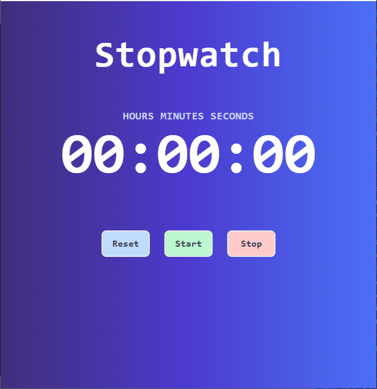
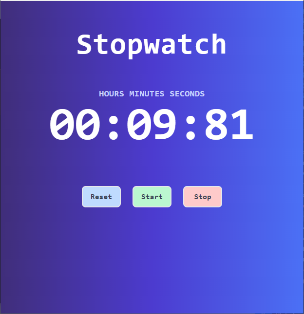

# Stopwatch

## Overview

This project is part of the Codevixens 10 Days of Frontend Challenge (Day 8). This stopwatch web application was built using Vite React and TailwindCSS. The task focuses on mastering state management, event handling and lifecycle methods.

## Features

- **State Management:** React's **useState** hook were used to handle elapsed time and running state of the stopwatch.
- **Event Handling:** This handles click events for the start, stop and reset buttons.
- **User Interface:** There are three buttons, which allows the user start, stop and reset the timer. There is also a display for the elapsed time.

## Installation

1. Clone the repository: ```javascript git clone https://github.com/Nkwor-Jane/stopwatch-app.git```

2. Navigate to the project directory: ```javascript cd stopwatch-app```

3. Install dependencies:```javascript npm install```

## Usage

1. Start the development server: ```javascript npm run dev```

2. Open your browser and navigate to: ```javascript http://localhost:5173/```

## How it Works

The Stopwatch component is the main React component. It handles the following:

1. **State Management:** Manages elapsed time and the running state of the stopwatch using useState.

2. **Rendering UI:** Renders three buttons, which allows the user start, stop and reset the timer. There is also a display for the elapsed time.

3. **Event Handling:** This handles click events for the start, stop and reset buttons.

## Screenshots

- Desktop View
  


- Mobile View



## Live Demo

Check out the live demo [here](https://idyllic-genie-bc32b0.netlify.app/).

## Key Concepts

1. **State Management:** To handle elapsed time and state of the stopwatch.
2. **Event Handling:** This handles click events for the buttons.

## Contirbuting

Feel free to clone and fork this repository. You can also submit pull requests. Any contributions are welcome!

## License

This project is licensed under the MIT License

## Acknowledgements

- [Codevixens](https://codevixens.org/) for organizing this challenge.
- Lois Bassey, Chinaza Igboanugo, Gaelle Tiku Brenda - and Oyakinsola Shoroye for their contributions and guidance towards the successful completion of this project.

Feel free to customize it further to fit your needs! If you have any specific details you'd like to add or change, let me know.
